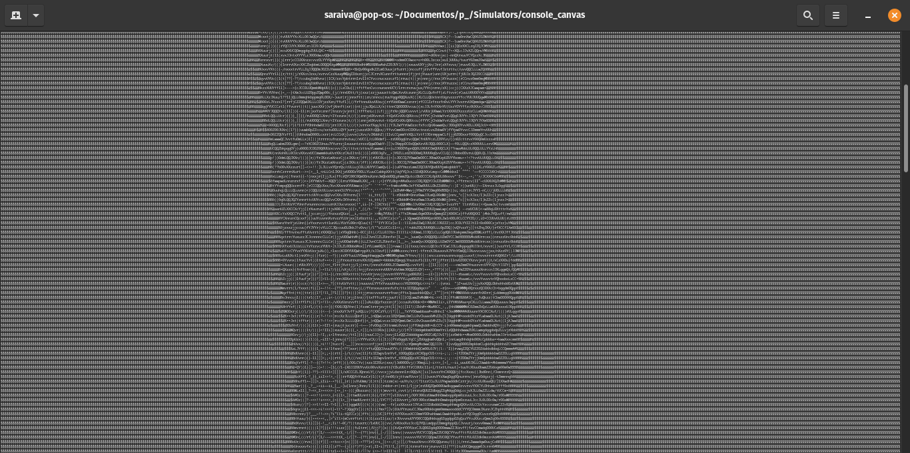
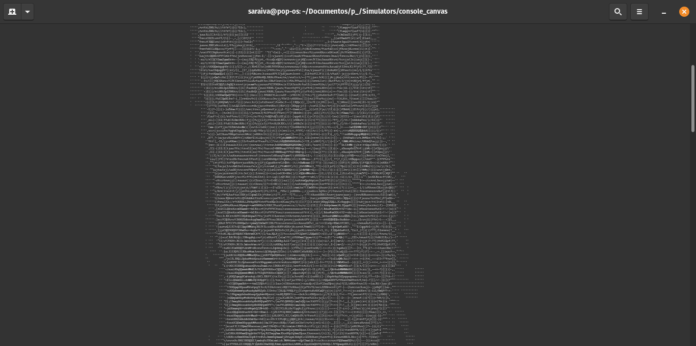

# Image to ascii converter


This is a C++ program that receives an image as input and prints an ascii art on the terminal.

## Important
The software was made to run only in gnome terminals.

## Running the app
```
./main [image_path] [...options]
```
### Options
| Syntax      | Short | Description |
| ----------- | ----- | ----------- |
| --negative  | -n    | Renders the image with inverted grayscale|

### Configurations
You can change the console font size to get a higher resolution result

### Results

*Cat*


*Negative cat*
